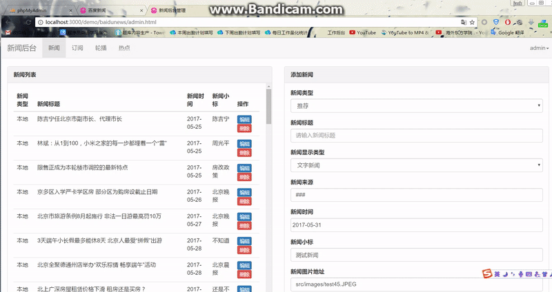

# baidunews
<h3>说明</h3>
    
1、该demo利用所学知识，仿照手机端百度新闻。如果侵权，请联系作者，作者将立即从github上移除该demo

    
2、前端采用jquery、后台采用bootstrap

<h3>实现功能</h3>
<h4>1、实现菜单栏的滚动、切换新闻以及轮播图效果</h4>

&nbsp;&nbsp;&nbsp;&nbsp;a) 滚动菜单内的lists、新闻items、轮播图items由后端php读取mysql内的数据并以json形式输出到前端接口，前端再由工厂函数输出；

&nbsp;&nbsp;&nbsp;&nbsp;b) 滚动效果采用腾讯前端团队alloyteam的alloytouch插件实现丝滑滚动效果。附alloytouch的github网址：https://github.com/AlloyTeam/AlloyTouch

&nbsp;&nbsp;&nbsp;&nbsp;c) 轮播图支持自动轮播以及触摸轮播，轮播图由自己封装的carousel插件实现，移动端轮播采用css3中transform：translateX属性，并将轮播图的包裹元素设置translate3d(0,0,0)开启gpu加速，使轮播更加顺滑，若采用pc端left属性写轮播插件，在低版本机器中出现卡顿现象

&nbsp;&nbsp;&nbsp;&nbsp;d) 切换新闻类型

     

<h4>2、实现订阅功能</h4>

&nbsp;&nbsp;&nbsp;&nbsp;a)订阅内的list由后台读取mysql内数据，并以工厂函数输出；

&nbsp;&nbsp;&nbsp;&nbsp;b)拖拽效果采用Sortable.js插件，附alloytouch的github网址：https://github.com/RubaXa/Sortable

&nbsp;&nbsp;&nbsp;&nbsp;c)删除订阅将修改mysql内的subscribeList，实现前端菜单list的改变

    

<h4>3、实现下拉显示更多</h4>

&nbsp;&nbsp;&nbsp;&nbsp;a)下拉采用原生的onscroll事件，但是该事件在ios和android上表现不一致，在android中可以实时触发，但是在ios8以前版本不能实时触发，ios8及以上版本采用wkwebview内核的浏览器可以实时触发。若采用alloytouch插件，则下拉会出现稍微的卡顿，故采用原生的onscroll事件，参考文献：http://www.alloyteam.com/2017/04/secrets-of-mobile-web-scroll-bars-and-drop-refresh/。

&nbsp;&nbsp;&nbsp;&nbsp;b)每次下拉从数据库中按时间顺序读取10条新闻

&nbsp;&nbsp;&nbsp;&nbsp;c)轮播以及新闻采用ajax回调形式加载，原本采用同级ajax事件，但是切换新闻若不加载更多新闻，切换流畅，但是加载更多则会出现ajax阻塞现象，导致浏览器假死。

     

<h4>4、实现新闻后台添加，删除，修改新闻、轮播图、订阅以及热点滚动</h4>

&nbsp;&nbsp;&nbsp;&nbsp;a)通过后台管理可以添加，删除，修改新闻、轮播图、订阅以及热点滚动到mysql中，并且由php输出到前端，在经过js实现前端输出

     

<h3>未来将加入以下功能</h3>

1、实现注册以及登录

2、实现登录的不同用户修改订阅输出修改后的订阅，未注册用户输出默认初始订阅页面（目前思路：将不同用户的配置信息填写到不同用户注册的表中）

